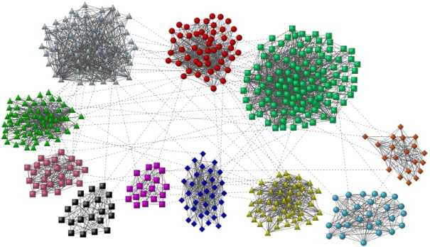

# INF 553 - Data Mining - USC
Homework solutions for INF553 (Data Mining) at University of Southern California. The raw data set is either included in the folder or downloaded from the Yelp public dataset.

## HW1: Data Exploration with Spark

In this assignment, I explore the Yelp dataset using Spark and Python.
1) Task 1: Data Exploration
2) Task 2: Data Partition
3) Task 3: Exploration on Multiple Datasets

## HW2: Frequent Itemset

In this assignment, I will implement SON Algorithm with A-priori using the Apache Spark Framework. I will develop a program to find frequent itemsets in two datasets, one simulated dataset and one real-world dataset generated from Yelp dataset.
1) Task 1: Frequent Itemset

Find frequent businesses and users in the simulated dataset

2) Task 2: SON algorithm

Apply SON algorithm  to the filtered basket market model in the large Ta Feng dataset

## HW3: Recommendation System

1) Task 1: LSH algorithm.

In this task, I develop the LSH technique using the yelp_train.csv file. The goal of this task is to find similar products according to the ratings of the users. Both Jaccard and Cosine similarity are implemented.

2) Task 2: Recommendation system

In this task, I build different types of recommendation systems (model-based, user-based, item-based) using theyelp_train.csv to predict for the ratings/stars for given user ids and business ids. I use the validation dataset (yelp_val.csv) to evaluate the accuracy of my recommendation systems.

## HW4: Community Detection

1) Task 1: Community Detection Based on GraphFrames

I use the Spark GraphFrames library to detect communities in the network graph. The library provides the implementation of the Label Propagation Algorithm (LPA). It is an iterative community detection solution whereby information “flows” through the graph based on underlying edge structure.

2) Task 2: Community Detection Based on Girvan-Newman algorithm

I use edge betweenness and modularity to divide the graph into suitable communities

## HW5: Streaming Algorithms

1) Task 1: Bloom Filtering

I implement the Bloom Filtering algorithm to estimate whether the US state of a coming business in the data stream has shown before. I find proper hash functions and the number of hash functions in the Bloom Filtering algorithm

2) Task 2: Flajolet-Martin algorithm

I implement the Flajolet-Martin algorithm (including the step of combining estimations from groups of hash functions) to estimate the number of unique cities within a window in the data stream.

3) Task 3: Fixed Size Sampling on Twitter Streaming

I analyze the twitter streaming data using Twitter APIs using Fixed Size Sampling Method (Reservoir Sampling Algorithm) to find popular tags on tweets based on the samples

## Project: Collaborative Filtering Recommendation System

I improve the performance of my recommendation system to improve the prediction accuracy and efficiency.
